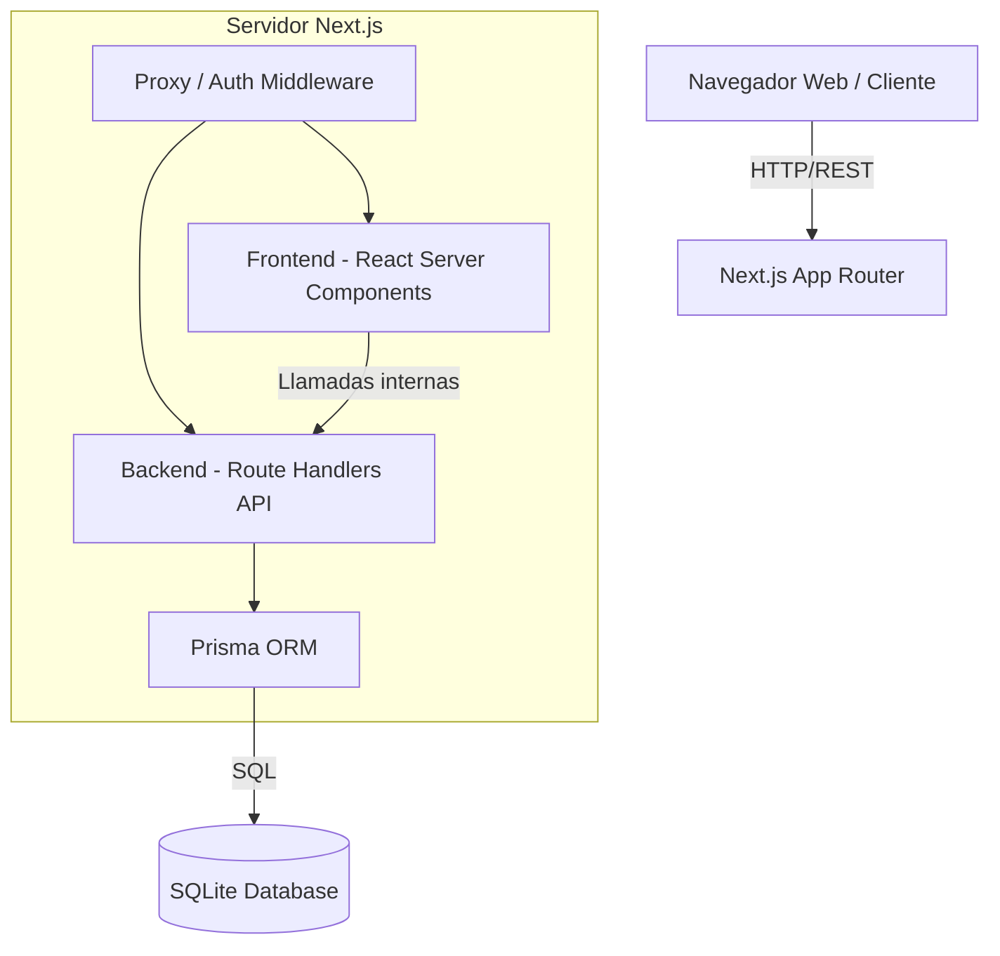
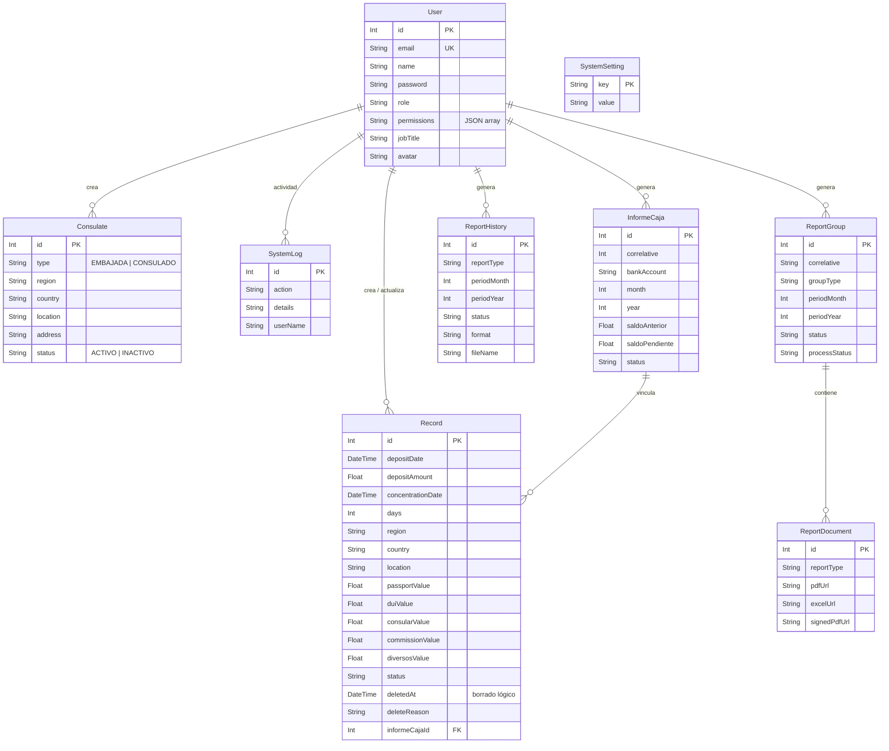

# Manual Técnico - SIC Hacienda

Este documento detalla la arquitectura de software, infraestructura y bases de datos que conforman el **Sistema de Ingresos Consulares (SIC) - Hacienda**. Está dirigido a Arquitectos de Software y Líderes Técnicos encargados del mantenimiento del sistema.

---

## 1. Arquitectura General del Sistema

El sistema sigue un modelo monolítico moderno basado en el framework **Next.js 16 (App Router)**. Abarca tanto el **Frontend** (Server Components y Client Components) como el **Backend** (Route Handlers/APIs), centralizando la lógica en un solo repositorio.

---

## 2. Capa de Frontend (Interfaz de Usuario)

El frontend está construido para ser rápido, reactivo y de una sola página (SPA-like) utilizando las convenciones más recientes de React.

*   **Framework:** Next.js 16 (App Router).
*   **Librería Principal:** React 19.
*   **Estilos:** Tailwind CSS v4 nativo. Se prescinde de librerías de componentes pesadas; se utilizan clases base nativas definidas en `globals.css` mediante variables CSS puras, garantizando máxima velocidad de carga.
*   **Iconografía:** `lucide-react`.
*   **Renderizado:** Se utiliza una mezcla de Server Components (para carga inicial de datos segura y SEO) y Client Components (`'use client'`) para interactividad y modales.

---

## 3. Capa de Backend y APIs

El backend está acoplado dentro del mismo proyecto Next.js utilizando **Route Handlers** (`src/app/api/...`), actuando como una API RESTful convencional.

### Seguridad y Autenticación
*   **JSON Web Tokens (JWT):** Las sesiones se manejan sin estado utilizando cookies firmadas con JWT.
*   **Proxy / Middleware:** El archivo `src/proxy.ts` actúa como un interceptor (Next.js 16 Proxy, runtime Node.js — no Edge) que valida el token JWT antes de que cualquier petición alcance las rutas protegidas, redirigiendo al login si la sesión no es válida o ha expirado (duración estándar de 8 horas). Las peticiones a `/api/*` sin sesión válida reciben `401 JSON` en lugar de un redirect.

### Endpoints Principales (APIs)
*   `POST /api/auth/login`: Validación de credenciales y generación de JWT.
*   `POST /api/ingresos` / `GET|PATCH|DELETE /api/ingresos/[id]`: Alta, consulta individual, edición y borrado lógico de ingresos. El listado de la bandeja lo resuelve el Server Component `/ingresos` directamente contra Prisma.
*   `GET /api/historial`: Devuelve los grupos de reportes (bandeja de reportes y tareas pendientes).
*   `POST /api/reportes/generar-grupo`: Genera un grupo mensual de reportes (PDF + Excel) y sus documentos.
*   `POST /api/reportes/avanzar-proceso`: Avanza la máquina de estados de firma (`Firma Jefatura` → `Modificación` → `Firma Recaudaciones` → `Finalizado`).
*   `POST /api/documentos/firmar`: Recibe la instrucción de firma digital y estampa el sello del funcionario sobre un documento PDF físico usando `pdf-lib`.
*   `POST /api/reportes/upload-signed`: Sube un PDF firmado a mano y marca el documento como firmado.
*   `POST /api/notificaciones` y `POST /api/notificaciones/reporte`: Envío real de correos vía SMTP (ver §6).
*   `GET /api/archivos/[...slug]`: Sirve los archivos de `storage/` con validación de extensión y de ruta (evita path traversal).
*   `GET|POST /api/settings`, `GET|POST|DELETE /api/usuarios[...]`: Parámetros del sistema y administración de usuarios (solo ADMIN).

### Motor de Reportes (Backend)
El sistema incluye librerías de servidor altamente especializadas para la generación en caliente de documentos oficiales:
*   `jsPDF` y `jspdf-autotable`: Para generación algorítmica de PDFs.
*   `exceljs`: Para la generación de matrices de cálculo descargables.

---

## 4. Base de Datos y Modelos (ORM)

La persistencia de datos es manejada mediante **Prisma ORM** apuntando a una base de datos relacional ligera **SQLite**, integrada para reducir la complejidad de infraestructura en entornos cerrados.

### Entidades Principales
1.  **User (Usuario):** Controla el acceso, rol (`ADMIN` / `USER`) y permisos por módulo (`ingresos`, `reportes`, `directorio`) almacenados como JSON en `permissions`. El rol `ADMIN` salta toda verificación de módulo.
2.  **Consulate (Consulado):** Catálogo maestro de procedencias (90 registros sembrados por `npm run db:seed`). No tiene relación FK con `Record`: los ingresos guardan región/país/ubicación como texto.
3.  **Record (Registro/Ingreso):** Almacena las transacciones económicas. Máquina de estados real (`src/lib/utils/status.ts`): `NO IDENTIFICADO` → `IDENTIFICADO NO DISTRIBUIDO` → `IDENTIFICADO DISTRIBUIDO`. Soporta borrado lógico (`deletedAt` + `deleteReason`).
4.  **InformeCaja (Informe de Caja):** Cabecera del informe de caja mensual con saldos; los `Record` pueden quedar vinculados a uno en estado `DEFINITIVO`, lo que bloquea su edición.
5.  **ReportGroup (Grupo de Reportes):** Agrupa los documentos mensuales por tipo de grupo (`Reportes Consulares` / `No Identificados / No Distribuidos`), gestiona el estado del documento (`PRELIMINAR`, `DEFINITIVO`, `DEFINITIVO MODIFICADO`, `N/A`) y el flujo de firma: `Firma Jefatura` → `Modificación` → `Firma Recaudaciones` → `Finalizado`.
6.  **ReportDocument (Documento):** Archivos físicos generados (PDF/Excel) derivados del grupo, que soportan URLs de versiones firmadas y sin firmar.
7.  **SystemSetting / SystemLog:** Parámetros de reportes y destinatarios de correo, y auditoría de actividad (visible para `ADMIN` en Configuración).
8.  **ReportHistory:** Registro histórico de generaciones individuales de reportes.

---

## 5. Decisiones Técnicas Clave

1.  **SQLite + Better SQLite3:** Se eligió esta combinación por la portabilidad en entornos gubernamentales, evitando dependencias externas de servidores de BD. Se configura en Next.js bajo `serverExternalPackages`.
2.  **Firma Digital Empotrada:** A diferencia de firmas criptográficas complejas externas, el sistema empotra visualmente los datos del funcionario (Firma Digital Estampada) superponiéndolos algorítmicamente en la coordenada exacta del PDF original.
3.  **Sistema de Archivos Local:** Los reportes generados se persisten en disco local dentro de `storage/` (nunca en `public/`) y se sirven autenticados a través de `GET /api/archivos/[...slug]`, con validación de extensión permitida y de que la ruta resuelta no escape de `storage/`. El servidor de alojamiento **debe** tener persistencia de disco; por lo que el despliegue en contenedores efímeros (como Vercel o Docker puro sin volúmenes) no está soportado sin configuraciones de almacenamiento adicionales.

---

## 6. Envío de Correos (SMTP)

El envío de notificaciones es real y está implementado con `nodemailer` en `src/lib/mailer.ts`:

*   **Configuración (`.env`):** `SMTP_HOST`, `SMTP_PORT` (por defecto 587), `SMTP_SECURE` (`true` solo para puerto 465), `SMTP_USER`, `SMTP_PASS`, `SMTP_FROM` y `SMTP_FROM_NAME`.
*   **Destinatarios:** se guardan en `SystemSetting` (`notif_rree_to`, `notif_rree_cc`, `notif_banco_to`, `notif_banco_cc`) y se pueden editar desde **Configuración → Parámetros de Reportes → Notificaciones por Correo**. Si no existen, se usan los valores por defecto de `src/lib/notify.ts`.
*   **Sin SMTP configurado:** la API responde `503` con un mensaje explícito; no simula el envío.
*   **Adjuntos:** `/api/notificaciones/reporte` localiza el PDF (preferentemente el firmado) del grupo de "No Identificados / No Distribuidos" del período y lo adjunta.

---

## 7. Datos Iniciales (Seed)

*   `npm run db:seed` (`prisma/seed.ts`): crea/actualiza el administrador y completa el directorio consular con los 90 registros de `prisma/consulates-data.ts`. Es idempotente y **no borra datos existentes**.
*   Si `SEED_ADMIN_PASSWORD` no está definido y el administrador ya existe, se conserva la contraseña actual (aviso en pantalla). Para cambiarla: `npm run reset-admin`.
*   `npm run db:migrate-status`: normaliza el campo `status` de los registros a los valores canónicos.
