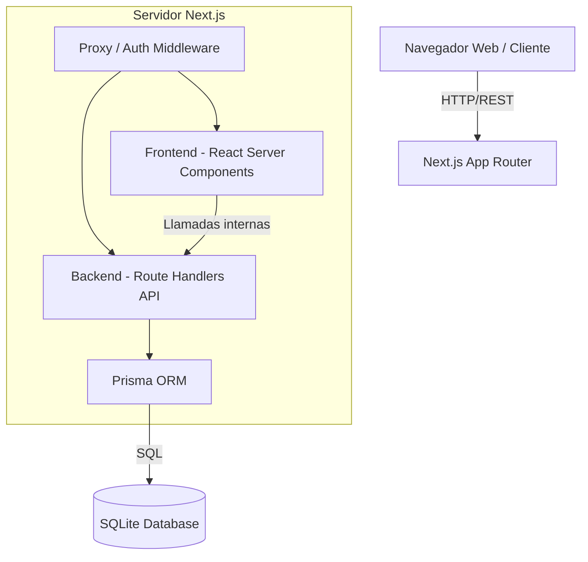
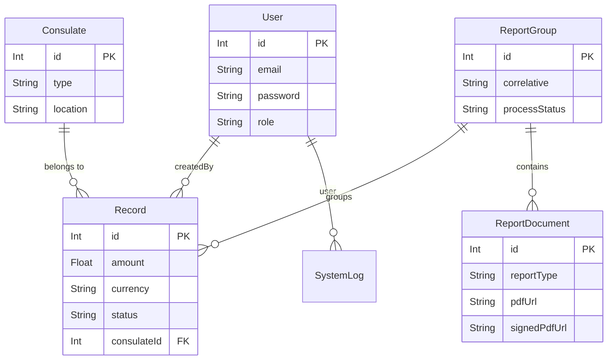

# Manual Técnico - SIC Hacienda

Este documento detalla la arquitectura de software, infraestructura y bases de datos que conforman el **Sistema de Ingresos Consulares (SIC) - Hacienda**. Está dirigido a Arquitectos de Software y Líderes Técnicos encargados del mantenimiento del sistema.

---

## 1. Arquitectura General del Sistema

El sistema sigue un modelo monolítico moderno basado en el framework **Next.js 16 (App Router)**. Abarca tanto el **Frontend** (Server Components y Client Components) como el **Backend** (Route Handlers/APIs), centralizando la lógica en un solo repositorio.

---

## 2. Capa de Frontend (Interfaz de Usuario)

El frontend está construido para ser rápido, reactivo y de una sola página (SPA-like) utilizando las convenciones más recientes de React.

*   **Framework:** Next.js 16 (App Router).
*   **Librería Principal:** React 19.
*   **Estilos:** Tailwind CSS v4 nativo. Se prescinde de librerías de componentes pesadas; se utilizan clases base nativas definidas en `globals.css` mediante variables CSS puras, garantizando máxima velocidad de carga.
*   **Iconografía:** `lucide-react`.
*   **Renderizado:** Se utiliza una mezcla de Server Components (para carga inicial de datos segura y SEO) y Client Components (`'use client'`) para interactividad y modales.

---

## 3. Capa de Backend y APIs

El backend está acoplado dentro del mismo proyecto Next.js utilizando **Route Handlers** (`src/app/api/...`), actuando como una API RESTful convencional.

### Seguridad y Autenticación
*   **JSON Web Tokens (JWT):** Las sesiones se manejan sin estado utilizando cookies firmadas con JWT.
*   **Proxy / Middleware:** El archivo `src/proxy.ts` actúa como un interceptor en el Edge (Next.js 16 Middleware) para validar el token JWT antes de que cualquier petición alcance las rutas protegidas, redirigiendo al login si la sesión expira (duración estándar de 8 horas).

### Endpoints Principales (APIs)
*   `POST /api/auth/login`: Validación de credenciales y generación de JWT.
*   `GET /api/ingresos`: Retorna el listado de registros paginado.
*   `POST /api/reportes/generar`: Invoca el motor de reportes para consolidar datos.
*   `POST /api/documentos/firmar`: Recibe la instrucción de firma digital y estampa el sello del funcionario sobre un documento PDF físico usando `pdf-lib`.

### Motor de Reportes (Backend)
El sistema incluye librerías de servidor altamente especializadas para la generación en caliente de documentos oficiales:
*   `jsPDF` y `jspdf-autotable`: Para generación algorítmica de PDFs.
*   `exceljs`: Para la generación de matrices de cálculo descargables.

---

## 4. Base de Datos y Modelos (ORM)

La persistencia de datos es manejada mediante **Prisma ORM** apuntando a una base de datos relacional ligera **SQLite**, integrada para reducir la complejidad de infraestructura en entornos cerrados.

### Entidades Principales
1.  **User (Usuario):** Controla el acceso y nivel de permisos (`ADMIN`, `USER`).
2.  **Consulate (Consulado):** Catálogo maestro de procedencias.
3.  **Record (Registro/Ingreso):** Almacena las transacciones económicas reportadas. Implementa una máquina de estados: `INGRESADO` -> `REVISADO` -> `VINCULADO`.
4.  **ReportGroup (Grupo de Reportes):** Agrupa transacciones mensuales y maneja la transición de la firma del informe general.
5.  **ReportDocument (Documento):** Archivos físicos generados (PDF/Excel) derivados del grupo, que soportan URLs de versiones firmadas y sin firmar.

---

## 5. Decisiones Técnicas Clave

1.  **SQLite + Better SQLite3:** Se eligió esta combinación por la portabilidad en entornos gubernamentales, evitando dependencias externas de servidores de BD. Se configura en Next.js bajo `serverExternalPackages`.
2.  **Firma Digital Empotrada:** A diferencia de firmas criptográficas complejas externas, el sistema empotra visualmente los datos del funcionario (Firma Digital Estampada) superponiéndolos algorítmicamente en la coordenada exacta del PDF original.
3.  **Sistema de Archivos Local:** Los reportes generados se persisten en disco local (`public/reports/`). El servidor de alojamiento **debe** tener persistencia de disco; por lo que el despliegue en contenedores efímeros (como Vercel o Docker puro sin volúmenes) no está soportado sin configuraciones de almacenamiento adicionales.
